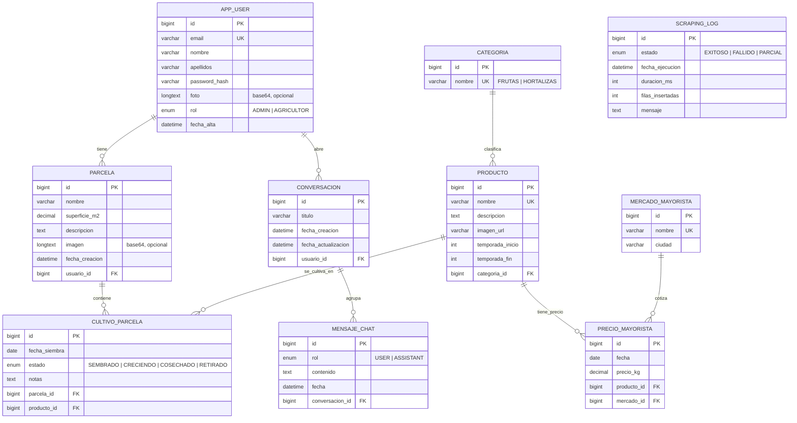

# Modelo de datos — AgroTrack

Diagrama entidad-relación del esquema actual de la base de datos (MySQL).
Renderiza automáticamente en GitHub / VS Code (Mermaid).

> `SCRAPING_LOG` no tiene relaciones: es una tabla de auditoría independiente de cada
> ejecución del scraper de Mercasa.

## Notas del esquema

- **Una parcela sin cultivos se considera "en barbecho"** (estado deducido, no almacenado).
- `app_user.foto` y `parcela.imagen` guardan imágenes como **data URL base64** (`LONGTEXT`).
- `conversacion` + `mensaje_chat` dan **persistencia a los chats** del asistente: se
  reconstruye el contexto (últimos 10 mensajes) desde la BD en cada petición.
- Al borrar una `parcela` se eliminan sus `cultivo_parcela`; al borrar una
  `conversacion` se eliminan sus `mensaje_chat`.
